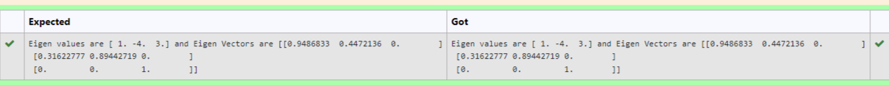

# EIGENVALUES-AND-EIGENVECTORS
## Aim:
To write a python program to find the Eigenvalues and Eigen Vectors
## Equipment’s required:
1. 	Hardware – PCs
2. 	Anaconda – Python 3.7 Installation / Moodle-Code Runner
## Algorithm:
### Step1 : import numpy as np
### Step 2: get inputs from the user using array
### Step 3: Using the np.linalg.eig(),  we get two results (first is eigenvalue and second is eigenvector) of the given matrix.
### Step 4: now pring the eigen values and eigen vectors

## Program:
```
#Program to find the eigen values and eigen vectors.
#Developed by: Yohesh Kumar
#RegisterNumber:22008459
import numpy as np
a=np.array([[2,-3,0],[2,-5,0],[0,0,3]])
x,y=np.linalg.eig(a)
print("Eigen values are {} and Eigen Vectors are {}".format(x,y))
```

## Output:

## Result:
Thus the Eigenvalue and Eigenvector is successfully solved using python program
